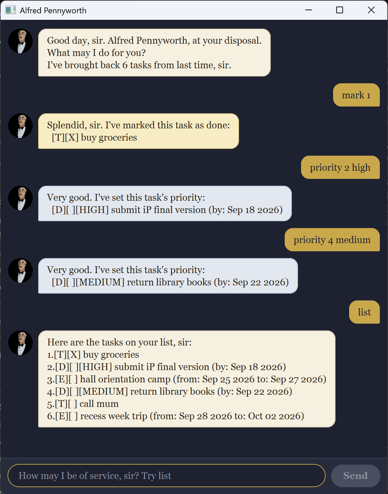

# Alfred Pennyworth User Guide



Alfred Pennyworth is a desktop app for keeping track of your tasks, in the manner of a butler: you type a short command, and Alfred does the rest. It is built for people who would rather type than click, so every feature is a single line of text, and everything you add is saved as you go.

## Quick start

1. Make sure you have Java 25 installed on your computer.
1. Download the latest `alfred.jar` from [the releases page](https://github.com/Gauhet/ip/releases).
1. Copy the file to the folder you want to use as the home folder for Alfred. Your tasks are saved in a `data` folder next to it.
1. Open a terminal, go to that folder, and run `java -jar alfred.jar`. A window opens with Alfred's greeting in it.
1. Type a command in the box at the bottom and press Enter or click **Send**. For example, `todo buy milk` adds a task, and `list` shows every task you have.
1. Refer to the [Features](#features) section for the details of each command.

## Features

**Notes about the command format:**

* Words in `UPPER_CASE` are the parts you supply. In `todo DESCRIPTION`, you might type `todo buy milk`.
* Dates are written as `YYYY-MM-DD`, such as `2026-09-30`. Alfred shows them back as `Sep 30 2026`.
* `TASK_NUMBER` is the number a task shows in `list`, counting from 1.
* Extra spaces are ignored, so `mark   2` works the same as `mark 2`.

Every task shows up in the same form: a type box, a status box, and a description. `[T][X] buy milk` is a todo that is done; `[D][ ] return book (by: Oct 15 2026)` is a deadline that is not.

### Adding a todo: `todo`

Adds a task with no date attached.

Format: `todo DESCRIPTION`

Example: `todo buy milk`

```
Very good, sir. I've added this task:
  [T][ ] buy milk
That makes 1 task on your list.
```

### Adding a deadline: `deadline`

Adds a task that is due on a particular day.

Format: `deadline DESCRIPTION /by DATE`

Example: `deadline return book /by 2026-10-15`

```
Very good, sir. I've added this task:
  [D][ ] return book (by: Oct 15 2026)
That makes 2 tasks on your list.
```

### Adding an event: `event`

Adds a task that runs from one day to another. An event can start and end on the same day, but it can't end before it starts.

Format: `event DESCRIPTION /from START_DATE /to END_DATE`

Example: `event project meeting /from 2026-12-02 /to 2026-12-03`

```
Very good, sir. I've added this task:
  [E][ ] project meeting (from: Dec 02 2026 to: Dec 03 2026)
That makes 3 tasks on your list.
```

**Note:** Alfred won't add a task that is already on your list. If you try, he tells you which number it already has.

### Listing all tasks: `list`

Shows every task on your list, numbered in the order you added them. These are the numbers the other commands use.

Format: `list`

```
Here are the tasks on your list, sir:
1.[T][ ] buy milk
2.[D][ ] return book (by: Oct 15 2026)
3.[E][ ] project meeting (from: Dec 02 2026 to: Dec 03 2026)
```

### Marking a task as done: `mark`

Puts an `X` in the task's status box.

Format: `mark TASK_NUMBER`

Example: `mark 2`

```
Splendid, sir. I've marked this task as done:
  [D][X] return book (by: Oct 15 2026)
```

### Marking a task as not done: `unmark`

Takes the `X` out again.

Format: `unmark TASK_NUMBER`

Example: `unmark 2`

```
Very well, sir. I've marked this task as not done yet:
  [D][ ] return book (by: Oct 15 2026)
```

### Deleting a task: `delete`

Removes a task from your list. The tasks after it move up one number, so check `list` before deleting the next one.

Format: `delete TASK_NUMBER`

Example: `delete 1`

```
As you wish, sir. I've removed this task:
  [T][ ] buy milk
That leaves 2 tasks on your list.
```

### Finding tasks by keyword: `find`

Shows the tasks whose description contains the given text. Capitalization doesn't matter, and everything after `find` counts as one phrase, so `find project meeting` looks for those two words together.

Format: `find KEYWORD`

Example: `find book`

```
Here are the matching tasks on your list, sir:
1.[D][ ] return book (by: Oct 15 2026)
```

The tasks keep the numbers they have in `list`, so you can use them with `mark`, `delete`, and the other commands straight away.

**Note:** `find` searches descriptions only. It doesn't look at dates or priorities.

### Seeing what falls on a day: `on`

Shows the deadlines due on a day and the events running over it, including their first and last days. Todos have no date, so they never appear.

Format: `on DATE`

Example: `on 2026-12-02`

```
Here is what you have on Dec 02 2026:
2.[E][ ] project meeting (from: Dec 02 2026 to: Dec 03 2026)
```

If nothing falls on that day, Alfred says so:

```
You have nothing on Dec 04 2026, sir.
```

### Setting a priority: `priority`

Marks how much a task matters, so that a long list still shows you what to do first. A task has no priority until you give it one.

Format: `priority TASK_NUMBER LEVEL`

* `LEVEL` is `high`, `medium`, `low`, or `none`. Capitalization doesn't matter, so `HIGH` and `High` both work.
* `none` takes a priority off again.

Example: `priority 1 high`

```
Very good. I've set this task's priority:
  [D][ ][HIGH] return book (by: Oct 15 2026)
```

A task with a priority shows it in a box after its status box, in `list` and everywhere else. A task without one shows no box at all.

### Exiting the program: `bye`

Alfred says goodbye, and the window closes a moment later.

Format: `bye`

```
Very good, sir. I shall be here when you need me.
```

### Saving your tasks

Your tasks, along with their status and priority, are saved to `data/alfred.txt` in the folder you ran Alfred from, after every command that changes them. There is nothing to save by hand, and they're all there the next time you start Alfred.

**Caution:** If you edit the file yourself and a line comes out in a form Alfred can't read, that line is skipped when the file is loaded, and it isn't kept. Back the file up before editing it.

### When something goes wrong

If a command is incomplete or Alfred doesn't recognize it, he explains what was wrong in a highlighted reply, and your list is left exactly as it was. For example, `deadline return book` without a `/by` date draws:

```
A deadline needs a description and a /by date, sir.
```

## Command summary

| Action | Format, example |
| ------ | --------------- |
| **Add a todo** | `todo DESCRIPTION` <br> for example, `todo buy milk` |
| **Add a deadline** | `deadline DESCRIPTION /by DATE` <br> for example, `deadline return book /by 2026-10-15` |
| **Add an event** | `event DESCRIPTION /from START_DATE /to END_DATE` <br> for example, `event project meeting /from 2026-12-02 /to 2026-12-03` |
| **List** | `list` |
| **Mark** | `mark TASK_NUMBER` <br> for example, `mark 2` |
| **Unmark** | `unmark TASK_NUMBER` <br> for example, `unmark 2` |
| **Delete** | `delete TASK_NUMBER` <br> for example, `delete 1` |
| **Find** | `find KEYWORD` <br> for example, `find book` |
| **On a day** | `on DATE` <br> for example, `on 2026-12-02` |
| **Priority** | `priority TASK_NUMBER LEVEL` <br> for example, `priority 1 high` |
| **Exit** | `bye` |
